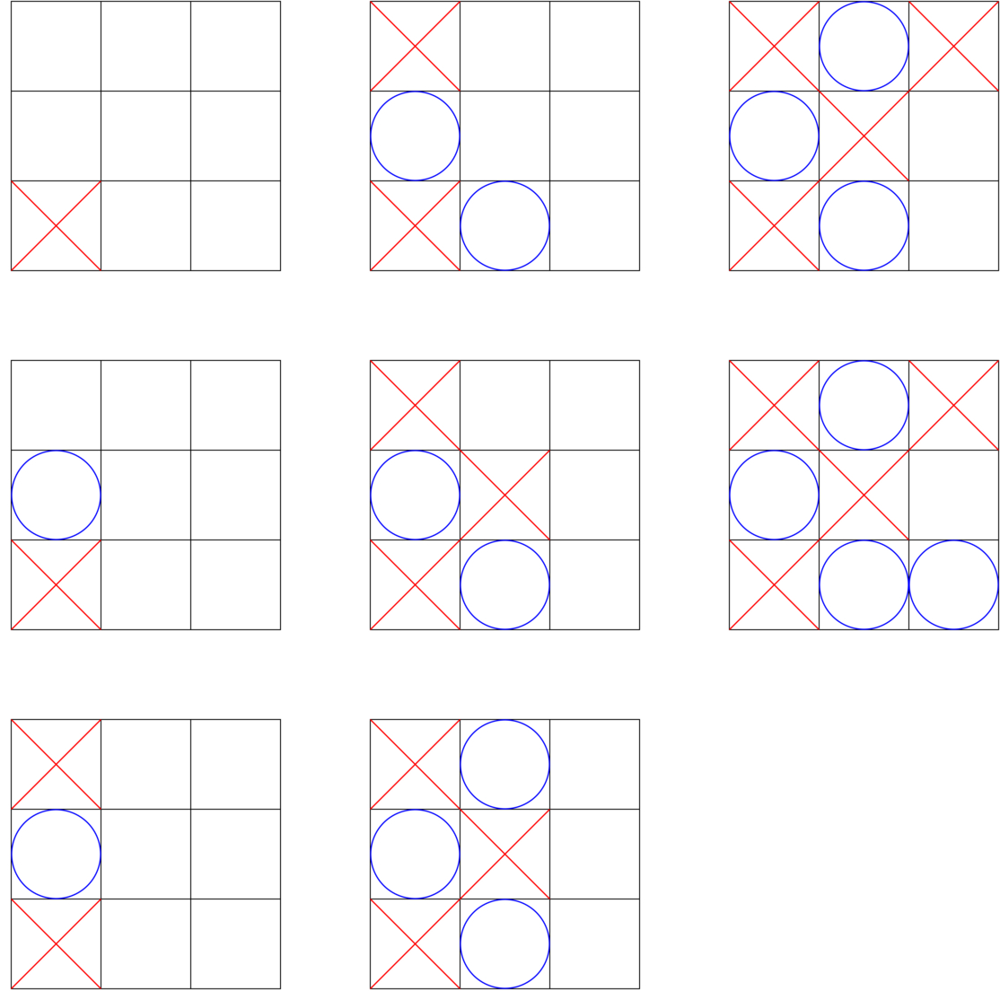

# tic_tac_toe_jgraph

For my Jgraph lab i decided to create a program that create a graph of all the turns of a tic tac toe game. The user will have to provide a data file containing information about the tic tac toe game. Each line of the data file will contains a 'X' or 'O' to represent who's turn it was. The char will be followed by a x and y coordinate representing a space on the tic tac toe board. See below for an example of a data file

```Example:
X 0 0
O 0 1
X 0 2
O 1 0
X 1 1
O 1 2
X 2 2
O 2 0
```

## Compilation Instruction

run `g++ tic_tac_toe.cpp -o tic_tac_toe.cpp` to compile the cpp file

or

run `make`

Once file is compiled run `./jgraph tic_tac_toe.jgr | convert -density 400 tic_tac_toe.ps -resize 25% -quality 92 tic_tac_toe.jpg ` to create a jpg file

Example:


